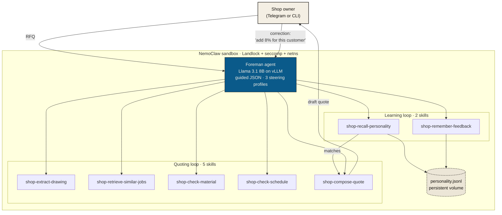

<div align="center">

# Foreman

**A quoting hand for small US machine shops.**
Reads the drawing. Checks the schedule. Writes the quote.
Remembers what you tell it. Lives on a computer in your shop.

[](./LICENSE)
[](https://www.media.mit.edu/)
[](#quick-start)

[**🌐 Live site →**](https://foremanjobs.lovable.app/) &nbsp; · &nbsp; [**📐 Architecture**](#architecture) &nbsp; · &nbsp; [**⚙️ Quick start**](#quick-start) &nbsp; · &nbsp; [**🧠 The learning loop**](#example-3-the-learning-loop-end-to-end)

</div>

---

## In one paragraph

A US machine shop with $5M to $30M revenue quotes 80 to 120 RFQs every week. Each one takes the best estimator, usually the owner, 30 to 90 minutes. Owners lose 30 to 50 percent of bids because they cannot respond fast enough. Foreman is an agent that reads a customer drawing, checks the shop's inventory and schedule, retrieves similar past jobs, applies any prior owner feedback for that customer, and produces a draft quote in under three minutes. The owner reviews, edits, sends. Every correction the owner makes is remembered and applied to the next matching RFQ, automatically. The whole stack runs on a computer in the shop; drawings never leave the building.

## Why this exists, briefly

I spent eleven years running the CNC shop my father built. Every other quoting tool I looked at was either built for enterprise shops or was a generic spreadsheet calculator. Nothing in this segment learned from the owner the way a real foreman does. I came to MIT AI Studio (MAS.664) to build the tool I wished existed. This is the open-source release of that work.

---

## What it does

1. **Extracts** structured fields from a drawing PDF: material, tolerances, features, finish, thread callouts. Works on Spanish-language drawings, mixed imperial/metric, and aged scanned drawings. Reducto handles perception; the agent reasons over the structured output.
2. **Retrieves** the shop's three most similar past jobs (won and lost), with quoted prices and actual hours.
3. **Checks** raw-material inventory and machine schedule slack in parallel.
4. **Recalls** any prior feedback the owner has given for this customer + material + part family.
5. **Composes** a draft quote under one of three steering profiles (Hold the line / Book rate / Win it), with the neutral-versus-adjusted math shown in the reasoning field.
6. **Remembers** every correction the owner makes ("this customer pays slow, add 8 percent") and applies it automatically to the next matching RFQ.

The last step is the product. Everything else is scaffolding for it.

---

## Architecture



A single declarative `blueprint.yaml` defines: three vLLM profiles, network allowlist, read/write filesystem scopes, personality-store location, agent system prompt, and the tool registry. Swap profiles or backends without touching the skills.

---

## The seven skills

| Skill | What it does |
|---|---|
| `shop-extract-drawing` | PDF → structured schema. Three tiers: cached demo fast path, pre-staged Reducto sidecar, pdfplumber local fallback. |
| `shop-retrieve-similar-jobs` | Top-3 historical jobs for a material + customer, including at least one loss for benchmark pricing. |
| `shop-check-material` | Raw-material inventory and supplier lead time. |
| `shop-check-schedule` | Machine slack and earliest available slot. |
| `shop-compose-quote` | Final quote under one of three steering profiles. Accepts `personality_json` from the recall skill plus agent-derived `margin_pct` and `lead_delta_days` so the displayed price moves in sync with the cited feedback. |
| `shop-remember-feedback` | Persists a correction to `personality.jsonl` in the sandbox data volume. |
| `shop-recall-personality` | Customer-gated retrieval over the personality store. Called before every compose. |

Each skill is a `SKILL.md` plus a bash (or bash + python) runner. The `SKILL.md` uses absolute paths under `/sandbox/.openclaw-data/skills/...` and embeds an inline JSON fallback so the agent can answer from documentation if the script path fails.

---

## Steering profiles

Same drawing, same customer, same quantity, three visibly different quotes. Measured on the hero demo (150-pc Boeing 82-Alpha bracket, 6061 aluminum):

| Profile | Temp | System prompt append | $/unit | Total | Lead | Clarifying Q |
|---|---|---|---:|---:|---:|---|
| **Hold the line** (conservative) | 0.1 | +15% margin, +3d buffer, always ask | $35.65 | $5,348 | 10 d | Yes |
| **Book rate** (balanced, default) | 0.3 | — | $31.00 | $4,650 | 7 d | No |
| **Win it** (aggressive) | 0.4 | –8% margin, tighter lead, cite lost bid | $28.52 | $4,278 | 5 d | No |

A swing of $1,070 on a single RFQ. The profile is set in `blueprint.yaml` and can be flipped by the owner at any time. Steering stacks on top of learned personality; margin and lead adjustments from stored feedback apply on top of the steering-chosen base.

---

## Quick start

### What you need

| Component | Minimum | Recommended |
|---|---|---|
| GPU | NVIDIA 24 GB VRAM (L4, A10, 4090) | A100 40 GB |
| RAM | 32 GB | 64 GB |
| Storage | 100 GB SSD | 1 TB NVMe |
| OS | Linux x86_64 (Ubuntu 22.04+) | same |
| Tooling | `git`, `bash`, Python 3.10+, Node.js 20+, Docker | same |
| HF token | needed for Llama 3.1 weights | same |

If you only want to read the code or run the skills without inference, see [Skills-only mode](#skills-only-mode-no-gpu) below.

### Full agent mode

```bash
git clone https://github.com/odominguez7/foreman.git
cd foreman

# 1. vLLM inference server
python3 -m venv /opt/vllm-venv
/opt/vllm-venv/bin/pip install vllm==0.6.3 huggingface_hub
export HF_TOKEN=hf_your_token
/opt/vllm-venv/bin/python -m vllm.entrypoints.openai.api_server \
  --model meta-llama/Llama-3.1-8B-Instruct \
  --host 0.0.0.0 --port 8000 \
  --dtype float16 --max-model-len 4096 \
  --enable-auto-tool-choice --tool-call-parser llama3_json

# 2. NemoClaw sandbox
npm install -g @nvidia/nemoclaw-cli
nemoclaw onboard --blueprint ./blueprint.yaml
for s in skills/shop-*; do
  nemoclaw foreman-agent skill install "$s"
done
cp -r demo-data/inbound/* /sandbox/.openclaw-data/media/inbound/

# 3. First quote
nemoclaw foreman-agent connect
openclaw agent --agent main \
  -m "Quote demo_1.pdf for the aerospace customer, 150 pieces, book rate"
```

Expected: $31/unit, $4,650, 7 days, confidence 0.9.

### Skills-only mode (no GPU)

Each skill runs as a standalone bash script. Useful for inspecting behavior, debugging, or contributing without the inference stack.

```bash
git clone https://github.com/odominguez7/foreman.git
cd foreman/skills/shop-extract-drawing
./shop-extract-drawing.sh demo_1.pdf
# returns the cached demo extraction JSON
```

---

## Usage examples

### Example 1 · Quote a synthetic demo PDF

```bash
openclaw agent --agent main \
  -m "Quote demo_1.pdf for the aerospace customer, 150 pcs, book rate"
```

The agent calls `shop-extract-drawing` (cached fast path), then `shop-retrieve-similar-jobs`, `shop-check-material`, `shop-check-schedule`, and `shop-recall-personality` in parallel, then `shop-compose-quote`. Returns the four-color quote object with reasoning and clarifying-question fields.

### Example 2 · Quote a real Bosch drawing (Spanish, AISI D-2 tool steel)

```bash
openclaw agent --agent main \
  -m "Quote bosch-punzon.pdf for Bosch Frenos, 8 pieces, hold the line"
```

The agent reads the pre-staged Reducto sidecar (real extraction from a real drawing), notices the hardness spec (60-62 HRC) and the Spanish-language tolerance notes, asks a clarifying question about ambiguous tolerance markings, and quotes accordingly. Demonstrates real-drawing handling.

### Example 3 · The learning loop end-to-end

```bash
# Initial quote (neutral)
openclaw agent --agent main --session-id learn-demo \
  -m "Quote demo_1.pdf for the aerospace customer, 150 pcs, book rate"
# → $31/unit, no clarifying question

# Owner correction (feedback signal)
openclaw agent --agent main --session-id learn-demo \
  -m "That's too low. They always pay slow. Add 8% margin."
# Agent calls shop-remember-feedback automatically.
# Stored to /sandbox/.openclaw-data/shop-memory/personality.jsonl

# A different drawing for the same customer, same session-id
openclaw agent --agent main --session-id learn-demo \
  -m "Quote demo_3.pdf for the aerospace customer, 80 pcs, book rate"
# → $68.85/unit (was $63.75 neutral, +8% applied)
# Reasoning field cites the prior feedback verbatim AND shows the math:
# "Applied prior feedback for this customer: pays slow — +8%. 
#  Numeric adjustment: +8% margin (neutral $63.75/u → $68.85/u)."
```

The personality survives sandbox restarts; the `personality.jsonl` lives on the persistent volume.

---

## Repository layout

```
foreman/
├── blueprint.yaml              # NemoClaw blueprint: profiles, network, memory, agent, tools
├── skills/                     # The 7 agent skills
│   ├── shop-extract-drawing/
│   ├── shop-retrieve-similar-jobs/
│   ├── shop-check-material/
│   ├── shop-check-schedule/
│   ├── shop-compose-quote/
│   ├── shop-remember-feedback/
│   └── shop-recall-personality/
├── demo-data/inbound/          # 5 demo PDFs + Reducto sidecars
├── docs/
│   ├── DEMO_SCRIPT.md          # 5-minute live demo walkthrough
│   ├── SATURDAY_PLAYBOOK.md    # Hour-by-hour bring-up playbook
│   ├── peer-test-template.md   # HW9 peer-test feedback form
│   ├── launch/                 # HW9 launch posts (X / LinkedIn / Reddit)
│   └── whitepaper/             # HW9 optional white paper
├── website/                    # Marketing site (HTML + JSX, no build step)
│   ├── index.html
│   ├── src/                    # React via Babel-standalone
│   ├── copy.md                 # Site copy as text source of truth
│   ├── lovable-prompt.md       # Lovable brief for the cinematic variant
│   ├── lovable-pricing-update.md
│   └── audit-recommendations.md
├── LICENSE
└── README.md
```

---

## Limitations

This is a course project and a working demo, not production software. The honest list:

- **Historical job data is synthetic.** `shop-retrieve-similar-jobs` returns a small hardcoded set (about 8 jobs across 6061 aluminum, 1018 steel, and 304 stainless). A real deployment wires this to the shop's ERP (ProShop, JobBOSS, E2, Global Shop, Fulcrum) over SQL or ODBC.
- **Inventory and schedule are synthetic.** `shop-check-material` and `shop-check-schedule` return fixed mock data. Production deployments pull from live systems.
- **Drawing extraction has two quality tiers.** Real drawings go through pre-staged Reducto sidecars (accurate but pre-computed for the demo PDFs). Unknown drawings fall back to pdfplumber and agent reasoning, which is lower quality. A production build wires `shop-extract-drawing` directly to the Reducto API.
- **Personality retrieval is exact-match.** Customer name must match exactly. Production should use sentence-transformer embeddings so "Aerospace Customer" matches "AeroSupply, Inc." and "Aerospace Tier-2 Supplier."
- **No authentication, no audit trail.** The sandbox is single-user. A real shop deployment needs owner login and an append-only audit of every quote sent.
- **Language support is partial.** Tested on English and Spanish drawings. German and Japanese have not been tested.
- **Designed for one shop at a time.** 80 to 120 quotes per week, single owner, single sandbox. Not multi-tenant SaaS.
- **Latency claims are targets.** A previously published "4× vLLM-versus-cloud" number was an aspiration, not a measurement. Real numbers depend heavily on GPU choice; we will publish measured benchmarks once Foreman runs on a stable deployment target.

---

## Course deliverables (MIT AI Studio · MAS.664 · HW9)

For graders and classmates landing here from the assignment.

| Deliverable | Where |
|---|---|
| Open-source repo with strong README (setup, usage, architecture, limitations) | This file + the rest of the repo |
| Deployed website / docs page | [foremanjobs.lovable.app](https://foremanjobs.lovable.app/) |
| Optional white paper | [`docs/whitepaper/foreman-whitepaper.md`](./docs/whitepaper/foreman-whitepaper.md) |
| Lightweight launch (X / LinkedIn / Reddit) | Post drafts in [`docs/launch/`](./docs/launch/) — see the per-platform README there |
| Confidential peer-test feedback | Template at [`docs/peer-test-template.md`](./docs/peer-test-template.md), filled-in version submitted to staff confidentially |

---

## Roadmap

- Sentence-transformer embeddings for personality retrieval
- Live ERP integration (ProShop or JobBOSS first)
- LoRA fine-tune of Llama 3.1 8B on per-shop feedback (personality becomes weights, not just retrievals)
- Voice channel via Twilio for phone-based RFQs
- Multi-agent: sales-facing vs shop-floor with approval handoff
- MCP server: expose Foreman skills to other agents (Salesforce, SolidWorks plugins, ERP add-ons)

---

## Contributing

This is a course project, but pull requests are welcome. The two areas where help would matter most:

1. **Real ERP integrations.** Start with ProShop, JobBOSS, or E2; SQL/ODBC adapters that map shop-specific schemas to the shape `shop-retrieve-similar-jobs` expects.
2. **Sentence-transformer personality retrieval.** Replace exact-match with semantic match. The interface (`shop-recall-personality`) does not need to change.

Open an issue first to discuss scope. Smaller PRs (typo fixes, docs improvements, demo-data additions) can go straight in.

---

## Acknowledgments

Foreman stands on:

- [**NemoClaw**](https://github.com/NVIDIA/NemoClaw) · NVIDIA's open agent sandbox (Landlock + seccomp + netns)
- [**vLLM**](https://github.com/vllm-project/vllm) · high-throughput inference server
- [**Llama 3.1 8B**](https://llama.meta.com/) · Meta's open language model
- [**Reducto**](https://reducto.ai/) · drawing extraction API
- [**MIT AI Studio (MAS.664)**](https://www.media.mit.edu/) · for the framing, the discipline, and the deadline

Special thanks to the shop owners across the United States who took calls, walked us through their morning routines, and corrected our assumptions. The product exists because they were generous with time they did not have.

---

## Citation

If you reference Foreman in academic work:

```bibtex
@misc{foreman2026,
  author = {Dominguez, Omar},
  title  = {Foreman: an on-prem agentic quoting assistant for US machine shops},
  year   = {2026},
  howpublished = {MIT AI Studio (MAS.664) open-source release},
  url    = {https://github.com/odominguez7/foreman}
}
```

---

## License

MIT. See [LICENSE](./LICENSE).

---

## Contact

Omar Dominguez · MIT · [omar.dominguez7@gmail.com](mailto:omar.dominguez7@gmail.com) · [github.com/odominguez7](https://github.com/odominguez7)

If you run a shop and want to see Foreman quote one of your own drawings live, write to the email above. A 20-minute call. No slides. Just your drawing and a quote.
